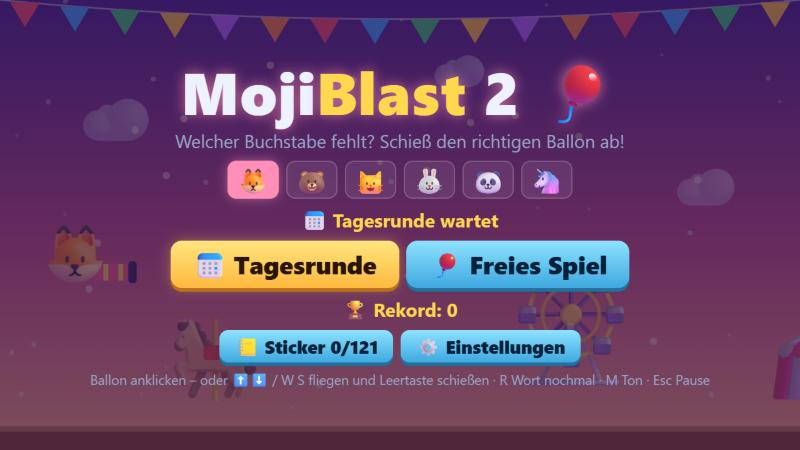
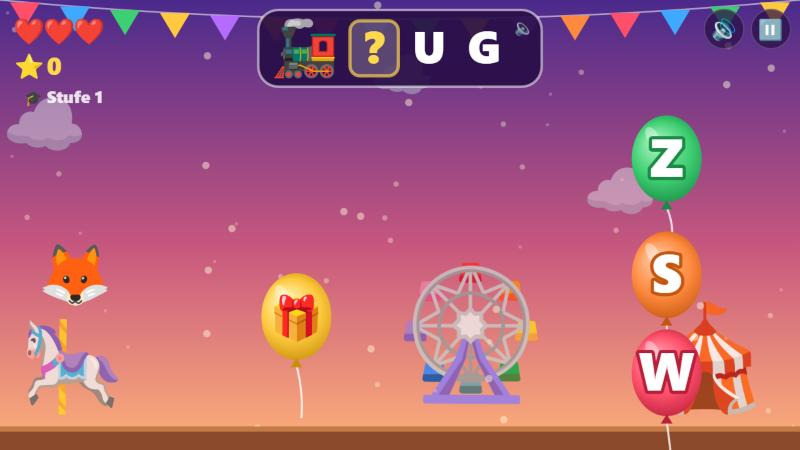

  

  

# MojiBlast 2 🎈

**Buchstaben-Lernspiel auf dem Jahrmarkt** – für Kinder in Klasse 1–2.

Oben steht ein Emoji mit seinem Namen, aber ein Buchstabe fehlt (🚂 `? U G`). Drei Luftballons mit Buchstaben schweben heran. Schieß den Ballon mit dem richtigen Buchstaben ab!

  

## Spielen

**Online:** 👉 **[dasistdaniel.github.io/MojiBlast2](https://dasistdaniel.github.io/MojiBlast2/)** – läuft am PC und auf dem Handy/Tablet (Querformat), als App installierbar und offline spielbar.

**Lokal:** `python -m http.server 8766` im Ordner starten und `http://localhost:8766` öffnen. Kein Build, keine Abhängigkeiten.

## Spielmodi

- **📅 Tagesrunde:** 10 Wörter, keine Herzen. Am Ende gibt es 1–3 ⭐ (je weniger Fehler, desto mehr). Die erste Runde des Tages zählt für die 🔥 Tage-Serie und bringt ein 🎁 Tagesgeschenk (ein Sticker).
- **🎈 Freies Spiel:** so lange spielen, bis die ❤️ weg sind. Rekord pro Einstellung und Profil.

## Profile, Lernstand und Sticker

- **Profile:** 6 Tier-Emojis (🦊 🐻 🐱 🐰 🐼 🦄). Jedes Kind hat eigene Einstellungen, Rekorde, Sticker und Lernstand, gespeichert im Browser.
- **🤖 Automatik:** Das Spiel merkt sich pro Buchstabe, wie sicher das Kind ist. Schwache Buchstaben kommen öfter, und früher verwechselte Buchstaben tauchen als falsche Ballons wieder auf. Bei 9 von 10 richtig geht es eine Stufe hoch (von „Anfang, kurze Wörter“ über „Laute“ bis „alles“, 9 Stufen), bei höchstens 5 von 10 wieder runter.
- **📒 Sticker:** Jedes richtig gelöste Wort schaltet sein Emoji im Album frei (noch gesperrte zeigen nur den Schatten). Das Album hat eine Seite pro Thema (Tiere, Essen, Fahrzeuge, Natur, Dinge, Körper); eine volle Seite bekommt einen goldenen Rahmen und eine 🏅 Meldung. Sticker antippen = Wort vorlesen.
- **Laute:** Ab Stufe 8 (oder per Einstellung „Laute“) fehlt ein ganzer Laut wie SCH, AU, EI, IE, EU oder CK. Die Ballons zeigen dann Lautgruppen (z. B. AU – EU – AI).
- **👪 Für Eltern** (⚙️ Einstellungen): zeigt pro Buchstabe und Laut, wie sicher das Kind ist (rot → grün, richtig/versucht), die häufigsten Verwechslungen und erlaubt das Zurücksetzen des Profils.
- **🎁 Goldene Ballons:** Ab und zu schwebt einer zwischen den Bahnen vorbei. Abschießen bringt einen Bonus-Sticker und Punkte, Verpassen kostet nichts.

## Steuerung

| | PC | Handy/Tablet (Querformat) |
|---|---|---|
| Zielen & schießen | Ballon anklicken | Ballon antippen |
| Fliegen | ⬆️⬇️ / W S | linke Bildschirmhälfte ziehen |
| Schießen | Leertaste / F | 🔥 (halten = Dauerfeuer) |
| Wort nochmal vorlesen | R | Emoji/Wort oben antippen |
| Ton an/aus | M | 🔊 |
| Pause | Esc / P | ⏸️ |

## Regeln

- Freies Spiel: 3 ❤️ zum Start, alle 10 richtigen Antworten gibt es ein Bonus-Herz (max. 5)
- Richtiger Ballon: +10 Punkte, ab einer Serie Bonuspunkte 🔥
- Falscher Ballon oder Ballons erreichen den Schützen: −1 ❤️ (nur im freien Spiel), der richtige Buchstabe wird gezeigt
- Das Wort wird vorgelesen (vorgefertigte Aufnahmen in `audio/words/`, abschaltbar)
- Mit jedem Treffer schweben die Ballons etwas schneller

## Einstellungen (⚙️ auf dem Titelbildschirm)

- **🤖 Automatisch** (Standard) oder eigene Auswahl:
- **Wo fehlt der Buchstabe?** Anfang · Mitte · Ende · Laute (kombinierbar)
- **Wörter:** kurz (3–4 Buchstaben) · mittel (5–6) · lang (7+)
- **🗣️ Vorlesen** an/aus

Bei einzelnen Buchstaben werden Laute wie SCH, CH, AU, EI, IE und Doppelbuchstaben (LL, FF …) nie auseinandergerissen; im Modus „Laute“ fehlt dagegen der ganze Laut. Falsche Buchstaben sind Verwechsler (B/D, M/N, E/F …) bzw. andere Vokale.

## Technik

- `index.html`, `style.css` – Bühne (16:9), Titel-, Pause- und Ergebnis-Bildschirm
- `words.js` – Wortliste mit Emojis, Regeln für Lückenpositionen
- `game.js` – Spiellogik, Aufgabengenerator, Zeichnen auf dem Canvas
- `audio.js` – Soundeffekte, Jahrmarkt-Musik (WebAudio) und Wort-Aufnahmen
- `tools/gen_voice.py` – erzeugt die Wort-Aufnahmen (`pip install edge-tts`, deutsche Stimme)
- `fonts/` – Schrift Andika (SIL OFL), für Leseanfänger gestaltet: `a` und `g` einstöckig, `b`/`d` und `I`/`l` gut unterscheidbar; selbst gehostet, also offline und ohne Google-Server
- `tools/check.mjs` – prüft Wortliste, Aufnahmen, Emoji-Bilder, Aufgabenlogik und Dateien (läuft als Pre-Commit-Hook: `node tools/check.mjs`)
- `emoji/` – alle Emojis als PNG (Noto Emoji von Google, Apache 2.0, siehe `emoji/LICENSE`), damit sie auf jedem Gerät gleich aussehen
- `tools/get_emojis.mjs` – lädt die Emoji-Bilder (`node tools/get_emojis.mjs`), `tools/gen_voice.py` erzeugt die Wort-Aufnahmen
- `sw.js`, `manifest.json`, `icons/` – PWA

Neue Wörter: in `words.js` ein Paar `['WORT', '🙂']` in `WORDS` ergänzen (GROSSBUCHSTABEN, eindeutiges Emoji), dann `python tools/gen_voice.py` und `node tools/get_emojis.mjs` ausführen.
